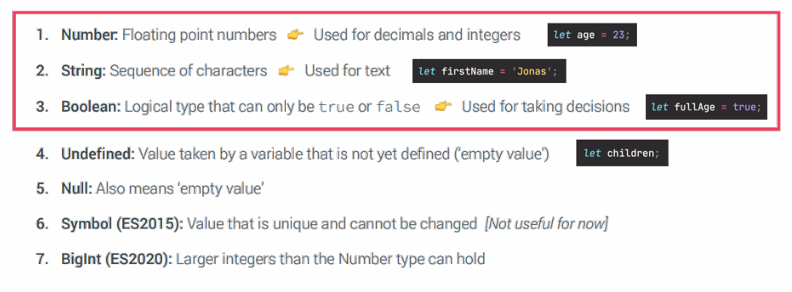

# Getting started with javascript  

JavaScript is a popular programming 
language that has a wide range of 
applications.
___

# JavaScript is also used in many other areas

___

# Objects and Primitives

object is 
``` javascript

 let me ={
    name: "Khurshed "
}
```
___
Primitives is
``` javascript

let firstName = "khurshed"
let age = 30;
```
___

# THE 7 primitive data types 



___
# Operators in JavaScript
 Name: Operators

 Arithmetics: + - * /

 Comparison: == => != !== <= ===

 Logical:  ||  &&  !
 ___

 # Three important topics
# 1 Conditions,  2 Loops, 3 Function

# Example for CONDITION  Ternary operator

___

# Loop  For
The for statement creates a loop that
 consists of three optional expressions, 
enclosed in parentheses and separated by
 semicolons, followed by a statement
 (usually a block statement) to be
 executed in the loop.
 ___
 ``` JavaScript
 
 let name = 10;
 for(let i=1;i<=name;i++){
    console.log(i);
 }
 ```

___

# Functions
 There are
 3
 ways of writing a function in JavaScript

 1 Function declaration:
 ``` JavaScript
 function Name(a,b){
      return a + b;
 }
 console.log(Name(2,3));
 ```
 ___

 2 Function expressions :

 ``` JavaScript

 let anonim=function(parametr){
   return parametr;
 }
 anonim("hello")


 let arrow=(parametr)=>{
   return parametr;
 }
 console.log(arrow("hello"));
 ```